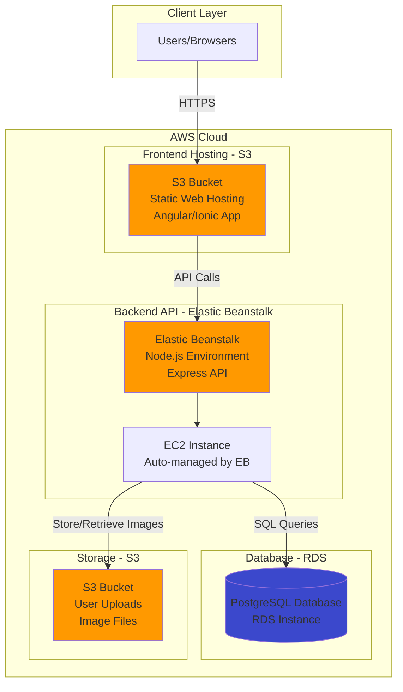

# Infrastructure Description

## Overview

The Udagram application is deployed on AWS using a multi-tier architecture that separates the frontend, backend API, and database into distinct services. This approach provides scalability, maintainability, and follows AWS best practices.

## Architecture Diagram



## AWS Services Used

### 1. Amazon S3 (Simple Storage Service)

**Purpose**: Hosts the frontend static files (HTML, CSS, JavaScript) and stores user-uploaded images.

**Configuration**:
- **Bucket 1 - Frontend Hosting**: 
  - Static website hosting enabled
  - Public read access for web files
  - CORS configuration to allow API calls
  - Index document: `index.html`
  - Error document: `index.html` (for Angular routing)

- **Bucket 2 - Media Storage** (optional, can use same bucket with different prefix):
  - Stores user-uploaded images
  - Public read access for images
  - Bucket policy allows AWS services to access contents

**Resources**:
- S3 bucket names must be globally unique
- Recommended naming: `udagram-frontend-[unique-id]` and `udagram-media-[unique-id]`

### 2. AWS Elastic Beanstalk

**Purpose**: Hosts and manages the Node.js/Express backend API.

**Configuration**:
- **Platform**: Node.js 14.x running on 64bit Amazon Linux 2
- **Environment Type**: Single instance (for free tier) or Load balanced (for production)
- **Instance Type**: t2.micro (free tier eligible) or t2.medium for better performance
- **Deployment Method**: ZIP file upload containing compiled application

**Features**:
- Automatic capacity provisioning
- Load balancing and auto-scaling (if configured)
- Application health monitoring
- Rolling updates with zero downtime
- Environment variables for configuration

**Environment Variables Required**:
```
POSTGRES_USERNAME=<db-username>
POSTGRES_PASSWORD=<db-password>
POSTGRES_HOST=<rds-endpoint>
POSTGRES_DB=postgres
AWS_BUCKET=<s3-bucket-name-for-media>
AWS_REGION=<aws-region>
JWT_SECRET=<secret-key>
URL=<frontend-url>
```

### 3. Amazon RDS (Relational Database Service)

**Purpose**: Hosts the PostgreSQL database for storing application data (users, feed items, metadata).

**Configuration**:
- **Engine**: PostgreSQL 12.x or 13.x
- **Instance Class**: db.t3.micro (free tier eligible)
- **Storage**: 20 GB General Purpose (SSD)
- **Multi-AZ**: Disabled (for cost savings in development)
- **Public Accessibility**: Yes (to allow local development and EB access)
- **Database Name**: `postgres`
- **Port**: 5432

**Security Group**:
- Inbound Rules: Allow PostgreSQL (port 5432) from:
  - Your local IP (for development)
  - Elastic Beanstalk security group (for production access)
  - 0.0.0.0/0 (for initial setup, restrict later for production)

**Backup**:
- Automated backups enabled
- Retention period: 7 days (configurable)

### 4. AWS IAM (Identity and Access Management)

**Purpose**: Manages access permissions for AWS services and CircleCI deployment.

**Configuration**:
- **IAM User**: Created for CircleCI with programmatic access
- **Permissions**: 
  - AmazonS3FullAccess (for frontend deployment)
  - AdministratorAccess-AWSElasticBeanstalk (for API deployment)
  - AWSElasticBeanstalkWebTier
  - AWSElasticBeanstalkWorkerTier
  - AWSElasticBeanstalkMulticontainerDocker

**Access Keys**:
- Access Key ID and Secret Access Key generated for CI/CD pipeline

## Infrastructure Specifications

### Estimated Costs (Free Tier)

| Service | Free Tier | Estimated Monthly Cost |
|---------|-----------|------------------------|
| RDS (db.t3.micro) | 750 hours/month | $0 (within free tier) |
| Elastic Beanstalk | No charge for EB itself | $0 |
| EC2 (t2.micro) | 750 hours/month | $0 (within free tier) |
| S3 | 5GB storage, 20K GET requests | $0-$1 |
| Data Transfer | 15GB/month | $0 (within free tier) |

**Note**: Costs may apply after free tier limits are exceeded or after 12 months.

### Network Architecture

```
Internet Gateway
       |
       v
   S3 Bucket (Frontend)
       |
       v
Internet Gateway
       |
       v
  Elastic Beanstalk
       |
       v
   EC2 Instance
       |
       v
   VPC Security Group
       |
       v
   RDS (PostgreSQL)
```

### Data Flow

1. **User Access**: User accesses the frontend application via S3 static website URL
2. **API Requests**: Frontend makes HTTP requests to Elastic Beanstalk endpoint
3. **Business Logic**: Express API processes requests on EC2 instance
4. **Data Persistence**: API queries PostgreSQL database on RDS
5. **Image Storage**: Uploaded images are stored in S3 media bucket
6. **Response**: API returns JSON response to frontend

## Security Considerations

### 1. Environment Variables
- All sensitive data (passwords, secrets, API keys) stored as environment variables
- Never committed to version control
- Configured in Elastic Beanstalk and CircleCI separately

### 2. Database Security
- Strong passwords enforced
- Connection only via SSL (configurable)
- Security group rules limit access
- Regular automated backups

### 3. S3 Security
- Bucket policies control access permissions
- CORS configuration limits cross-origin requests
- Media files have appropriate ACLs

### 4. API Security
- JWT-based authentication
- Password hashing with bcrypt
- CORS middleware configured
- Input validation and sanitization

## Scalability

### Current Setup (Development/Free Tier)
- Single EC2 instance
- Single RDS instance
- Basic S3 storage

### Production Scaling Options
1. **Elastic Beanstalk**: Enable auto-scaling and load balancing
2. **RDS**: Upgrade instance class, enable Multi-AZ deployment
3. **S3**: Enable CloudFront CDN for faster global delivery
4. **Database**: Implement read replicas for high read loads

## Monitoring and Maintenance

### Elastic Beanstalk Monitoring
- Health dashboard shows application status
- CloudWatch logs capture application logs
- Metrics for CPU, memory, network usage

### RDS Monitoring
- CloudWatch metrics for database performance
- Automated backups and point-in-time recovery
- Database performance insights

### S3 Monitoring
- Access logs for tracking requests
- Storage metrics and analytics
- Versioning for data protection (optional)

## Disaster Recovery

### Backup Strategy
- **RDS**: Automated daily backups with 7-day retention
- **S3**: Enable versioning for critical data
- **Code**: Source code stored in GitHub

### Recovery Process
1. Restore RDS from automated backup or snapshot
2. Redeploy application via CircleCI pipeline
3. Restore S3 data from versioned objects if needed

## Infrastructure as Code (Future Enhancement)

Consider implementing infrastructure as code using:
- AWS CloudFormation templates
- Terraform configurations
- AWS CDK (Cloud Development Kit)

This would allow:
- Version-controlled infrastructure
- Reproducible environments
- Automated environment provisioning
- Easier disaster recovery

