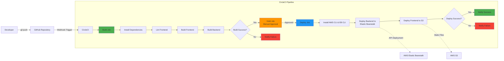

# CI/CD Pipeline Description

## Overview

The Udagram application uses CircleCI as the Continuous Integration and Continuous Deployment (CI/CD) platform. The pipeline automates the process of building, testing, and deploying the application to AWS whenever changes are pushed to the main branch of the GitHub repository.

## Pipeline Diagram



## Pipeline Stages

### Stage 1: Source Control (GitHub)

**Trigger**: 
- Push to `main` or `master` branch
- Can also be triggered manually from CircleCI dashboard

**Process**:
1. Developer commits code changes locally
2. Developer pushes changes to GitHub repository
3. GitHub webhook notifies CircleCI of new commits
4. CircleCI automatically clones the repository

### Stage 2: Build Job

**Purpose**: Install dependencies, lint code, and build both frontend and backend applications.

**Docker Image**: `cimg/node:14.15`

**Steps**:

1. **Checkout Code**
   - CircleCI checks out the code from GitHub repository
   - Uses the commit SHA that triggered the pipeline

2. **Install Frontend Dependencies**
   ```bash
   npm run frontend:install
   # Executes: cd udagram/udagram-frontend && npm install -f
   ```
   - Installs all Angular/Ionic dependencies
   - Uses force flag to bypass peer dependency conflicts
   - Dependencies installed in `node_modules/`

3. **Install Backend Dependencies**
   ```bash
   npm run api:install
   # Executes: cd udagram/udagram-api && npm install .
   ```
   - Installs all Node.js/Express dependencies
   - Includes TypeScript and development dependencies

4. **Lint Frontend Code**
   ```bash
   npm run frontend:lint
   # Executes: cd udagram/udagram-frontend && npm run lint
   ```
   - Runs ESLint/TSLint on Angular code
   - Checks for code quality and style issues
   - Fails build if critical linting errors found

5. **Build Frontend Application**
   ```bash
   npm run frontend:build
   # Executes: cd udagram/udagram-frontend && npm run build
   ```
   - Compiles Angular/TypeScript code
   - Produces production-optimized bundles
   - Outputs to `www/` directory
   - Minifies and tree-shakes code

6. **Build Backend API**
   ```bash
   npm run api:build
   # Executes: cd udagram/udagram-api && npm run build
   ```
   - Compiles TypeScript to JavaScript
   - Outputs to `www/` directory
   - Copies configuration files
   - Prepares deployment archive

**Output**:
- Frontend: Production-ready static files in `www/`
- Backend: Compiled JavaScript in `www/` with `Archive.zip`

**Success Criteria**:
- All dependencies installed without errors
- No critical linting errors
- All builds complete successfully
- Exit code 0 for all steps

### Stage 3: Hold Job (Manual Approval)

**Purpose**: Require manual approval before deploying to production environment.

**Type**: Approval gate

**Configuration**:
- Only runs for commits to `main` or `master` branch
- Requires a user to manually approve in CircleCI dashboard
- Prevents accidental deployments
- Allows for final review before production deployment

**Process**:
1. Build job completes successfully
2. Pipeline pauses and waits for approval
3. CircleCI sends notification (email/Slack)
4. Team member reviews build results
5. Team member clicks "Approve" in CircleCI UI
6. Deploy job starts automatically after approval

**Best Practices**:
- Review build logs before approving
- Check that all tests passed
- Verify no security vulnerabilities
- Can be skipped for development/staging branches

### Stage 4: Deploy Job

**Purpose**: Deploy the built application to AWS services.

**Docker Image**: `cimg/base:stable`

**Steps**:

1. **Install Node.js**
   - Installs Node.js 14.15 using CircleCI Node orb
   - Required for running deployment scripts

2. **Checkout Code**
   - Retrieves source code again
   - Necessary because deploy job runs in separate container

3. **Setup Elastic Beanstalk CLI**
   - Installs AWS EB CLI using CircleCI EB orb
   - Configures EB CLI with AWS credentials from environment variables
   - Required for deploying backend to Elastic Beanstalk

4. **Setup AWS CLI**
   - Installs AWS CLI v2 using CircleCI AWS orb
   - Configures AWS credentials from CircleCI environment variables
   - Required for deploying frontend to S3

5. **Set AWS Region**
   ```bash
   echo "export AWS_DEFAULT_REGION=$AWS_REGION" >> $BASH_ENV
   ```
   - Configures default AWS region for EB CLI
   - Uses region from CircleCI environment variables

6. **Deploy Backend API**
   ```bash
   npm run api:deploy
   ```
   
   **Substeps**:
   - Navigates to `udagram-api/` directory
   - Runs the build process again (for safety)
   - Lists available EB environments: `eb list`
   - Selects target environment: `eb use udagram-api-dev`
   - Deploys application: `eb deploy`
   - EB CLI uploads `Archive.zip` to S3
   - Elastic Beanstalk downloads and deploys the archive
   - Application server restarts with new code
   - Health check ensures deployment succeeded

7. **Deploy Frontend**
   ```bash
   npm run frontend:deploy
   ```
   
   **Substeps**:
   - Navigates to `udagram-frontend/` directory
   - Reinstalls dependencies (if needed)
   - Rebuilds the frontend
   - Makes deploy script executable: `chmod +x bin/deploy.sh`
   - Runs deploy script: `bin/deploy.sh`
   - Uploads all files from `www/` to S3 bucket
   - Sets public-read ACL for all files
   - Sets cache-control headers for `index.html`
   - Frontend immediately available at S3 URL

**Environment Variables Required**:
All these must be configured in CircleCI project settings:
- `AWS_ACCESS_KEY_ID`: IAM user access key
- `AWS_SECRET_ACCESS_KEY`: IAM user secret key
- `AWS_REGION`: AWS region (e.g., us-east-1)
- `AWS_DEFAULT_REGION`: Same as AWS_REGION for EB CLI
- `AWS_BUCKET`: S3 bucket name for frontend hosting
- `POSTGRES_USERNAME`: Database username
- `POSTGRES_PASSWORD`: Database password
- `POSTGRES_HOST`: RDS endpoint
- `POSTGRES_DB`: Database name
- `JWT_SECRET`: Secret for JWT token signing
- `URL`: Frontend URL

**Success Criteria**:
- Backend deployed successfully to Elastic Beanstalk
- Frontend files uploaded to S3
- Application accessible and functional
- Health checks passing

### Stage 5: Notifications

**Success Notifications**:
- CircleCI dashboard shows green checkmark
- Email notification sent to team members
- Can configure Slack/Discord webhooks for team notifications

**Failure Notifications**:
- CircleCI dashboard shows red X
- Email notification with error details
- Build logs available for debugging
- Deployment rolled back (Elastic Beanstalk automatic)

## Pipeline Configuration

### CircleCI Orbs Used

**1. Node.js Orb** (`circleci/node@5.0.2`)
- Simplifies Node.js installation
- Provides caching for `node_modules/`
- Version management

**2. AWS CLI Orb** (`circleci/aws-cli@3.1.1`)
- Installs and configures AWS CLI
- Handles credential configuration
- Provides S3 deployment commands

**3. Elastic Beanstalk Orb** (`circleci/aws-elastic-beanstalk@2.0.1`)
- Installs EB CLI
- Configures EB CLI with AWS credentials
- Simplifies deployment commands

### Workflow Configuration

```yaml
workflows:
  version: 2
  build-and-deploy:
    jobs:
      - build
      - hold:
          type: approval
          requires:
            - build
          filters:
            branches:
              only:
                - main
                - master
      - deploy:
          requires:
            - hold
          filters:
            branches:
              only:
                - main
                - master
```

**Key Points**:
- Jobs run sequentially: build → hold → deploy
- Deploy only runs for main/master branch
- Deploy requires approval (hold job)
- Other branches run build job only

## Build Optimization

### Caching Strategy
- CircleCI caches `node_modules/` between builds
- Reduces build time by skipping unchanged dependencies
- Cache invalidated when `package.json` changes

### Parallel Execution
- Currently, jobs run sequentially
- **Future Enhancement**: Run frontend and backend builds in parallel

### Resource Optimization
- Using appropriate Docker images for each job
- Minimal image for deploy job reduces startup time

## Security Considerations

### Secrets Management
- All secrets stored in CircleCI environment variables
- Never committed to source control
- Encrypted at rest and in transit
- Access limited to project members

### Access Control
- Only authorized GitHub accounts can trigger builds
- Manual approval required for production deployments
- AWS IAM user has minimal required permissions

### Branch Protection
- Only main/master branch triggers deployments
- Feature branches run builds only (no deploy)
- Prevents accidental production deployments

## Monitoring and Debugging

### Build Logs
- Full console output for each step
- Timestamped for performance analysis
- Retained for 30 days (CircleCI free tier)

### Deployment Verification
1. Check CircleCI build status
2. Verify Elastic Beanstalk health in AWS console
3. Visit frontend URL to test application
4. Check CloudWatch logs for errors

### Common Issues and Solutions

| Issue | Possible Cause | Solution |
|-------|---------------|----------|
| Build fails at install | Dependency conflict | Check package.json versions |
| Lint errors | Code quality issues | Fix linting errors locally |
| Deploy fails (Backend) | EB environment not found | Create EB environment first |
| Deploy fails (Frontend) | S3 bucket not found | Create S3 bucket first |
| Health check fails | Environment variables missing | Set variables in EB config |
| Timeout error | Large deployment package | Optimize bundle size |

## Pipeline Metrics

### Typical Execution Times
- **Build Job**: 5-8 minutes
  - Install dependencies: 3-4 minutes
  - Lint: 30 seconds
  - Build frontend: 2-3 minutes
  - Build backend: 1 minute

- **Deploy Job**: 8-12 minutes
  - Setup tools: 2 minutes
  - Backend deployment: 5-8 minutes
  - Frontend deployment: 1-2 minutes

- **Total Pipeline Time**: 15-20 minutes (excluding approval wait time)

### Resource Usage
- CircleCI credits per build: ~150-200 credits
- Free tier: 2500 credits/week = ~12-16 builds/week

## Future Enhancements

### Testing
- Add unit tests for backend (Mocha/Chai)
- Run frontend unit tests (Jasmine/Karma)
- Add end-to-end tests (Protractor/Cypress)
- Integration tests for API endpoints

### Deployment Strategies
- Blue-green deployments for zero downtime
- Canary deployments for gradual rollout
- Automatic rollback on health check failure

### Multi-Environment Support
- Separate staging and production environments
- Deploy PRs to staging automatically
- Promote staging to production after validation

### Monitoring Integration
- Send deployment notifications to Slack
- Track deployment frequency and success rate
- Monitor application performance post-deployment
- Integrate with error tracking (Sentry, Rollbar)

### Security Scanning
- Run dependency vulnerability scans (npm audit)
- Static code analysis (SonarQube)
- Container image scanning
- Compliance checks

## Rollback Procedure

### Manual Rollback

**Backend (Elastic Beanstalk)**:
1. Log into AWS Console
2. Navigate to Elastic Beanstalk environment
3. Go to "Application versions"
4. Select previous working version
5. Click "Deploy"
6. Wait for health check to pass

**Frontend (S3)**:
1. If S3 versioning enabled, restore previous version
2. Otherwise, re-run previous successful CircleCI build
3. Or manually upload previous build files to S3

### Automatic Rollback
- Elastic Beanstalk automatically rolls back if health checks fail
- CircleCI can be configured to run smoke tests post-deployment
- Failed smoke tests can trigger automatic rollback

## Best Practices

1. **Always test locally before pushing**: Run `npm run build` for both apps
2. **Use feature branches**: Develop in branches, merge to main when ready
3. **Review build logs**: Check for warnings even if build succeeds
4. **Monitor deployments**: Watch health checks after deployment
5. **Keep dependencies updated**: Regular security updates
6. **Document changes**: Clear commit messages
7. **Gradual rollout**: Test in staging before production
8. **Keep CircleCI config simple**: Clear, documented steps
9. **Use environment variables**: Never hardcode secrets
10. **Regular backups**: Database snapshots before major deployments

